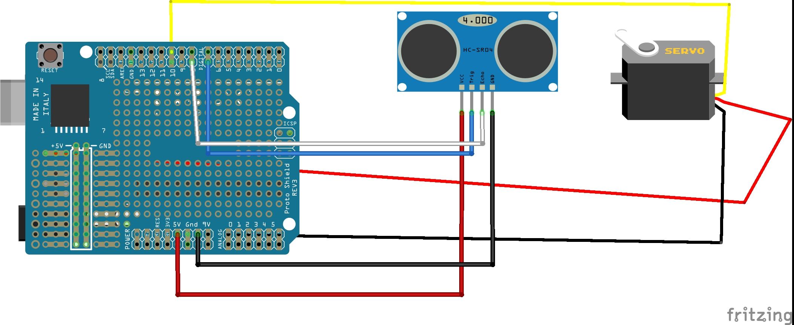

# Poubelle-automatique 
 Réalisation d'un montage permetant d'ouvrir automatiquement le couvercle d'une poubelle.
 
 ## Video
 
 

cliquer sur la photo au dessus pour lire la video

# Schema du montage

# Bibliothèque a utiliser
#include <Servo.h>
#include <HCSR04.h>

# Liste des composants
+ 1 Arduino UNO
+ 1 cable Arduino
+ 1 Bread Board
+ 1 Ultrasonic Sensor 
+ 1 Servo Motor
+ 7 Jumper Wire (cable male/male)
+ Prototype Expansion Board 
